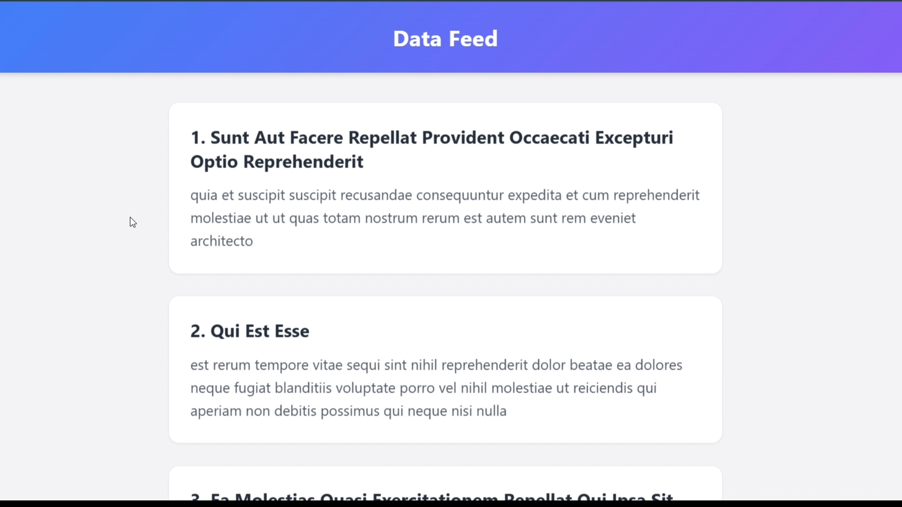
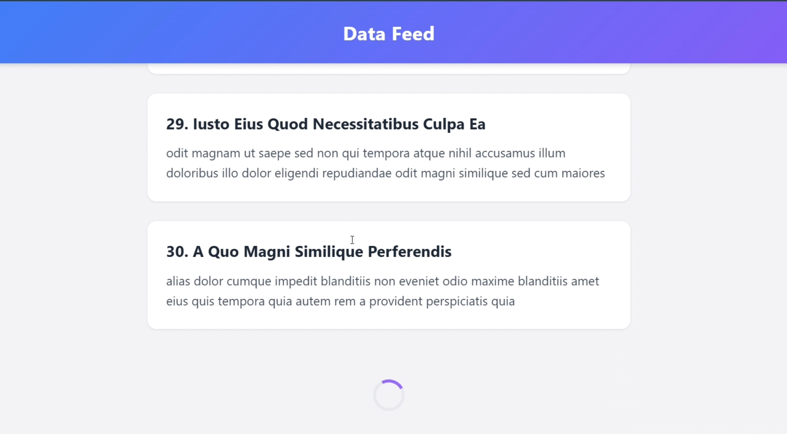

# Vanilla JS Infinite Scroll Viewer

A high-performance infinite scrolling data viewer built with Vanilla JavaScript. This project avoids traditional, inefficient scroll event listeners in favor of modern browser APIs to deliver a smooth data-fetching experience.

## Architecture & Data Flow

The application fetches pagination data from a REST API (`JSONPlaceholder`). Instead of attaching an event listener to the window's scroll event—which fires hundreds of times a second and causes main-thread blocking—this implementation uses the `IntersectionObserver` API. An invisible loader element at the bottom of the DOM tree is monitored; when it enters the viewport (with a 100px margin for pre-fetching), an API call is triggered. 

## Features

* **Intersection Observer API:** Efficient viewport tracking without scroll event bottlenecks.
* **Document Fragments:** Batches DOM node insertions to prevent excessive browser reflows and repaints.
* **CSS Animations:** Smooth `slideUpFade` integration for dynamically appended elements.
* **Asynchronous Fetching:** Non-blocking `async/await` requests for seamless user experience.
* **State Management:** Tracks loading state and end-of-data flags to prevent duplicate or unnecessary network requests.

## Visuals

### Live Demo
<video src="./demo.mp4" controls="controls" width="100%">
  Your browser does not support the video tag.
</video>

### Screenshots

**Initial Load**


**Loading State**


## Tech Stack

| Technology | Purpose |
| :--- | :--- |
| **HTML5** | Semantic structure, container definitions. |
| **CSS3** | Responsive Grid/Flexbox layout, CSS Keyframe animations for DOM insertion. |
| **JavaScript (ES6+)** | `IntersectionObserver`, `Fetch API`, `DocumentFragment`, `async/await`. |

## Local Setup

1.  Clone the repository:
    ```bash
    git clone https://github.com/vigneshpraveen-official/infinite-scroll.git
    ```
2.  Navigate to the directory:
    ```bash
    cd infinite-scroll
    ```
3.  Open `index.html` directly in any modern browser. Internet connection is required to fetch the mock API data.

## Technical Highlights for Reviewers

* **Performance over Implementation:** Solves the classic "scroll jank" problem. The `rootMargin: '100px'` configuration ensures data is requested *before* the user hits the absolute bottom, creating the illusion of zero load time.
* **Memory Efficiency:** Uses `document.createDocumentFragment()` to compose the new elements off-screen. It appends the fragment to the live DOM exactly once per fetch, minimizing rendering overhead.